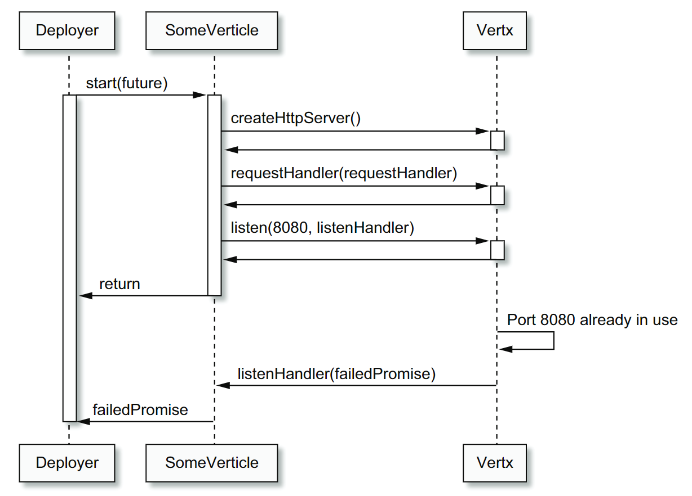
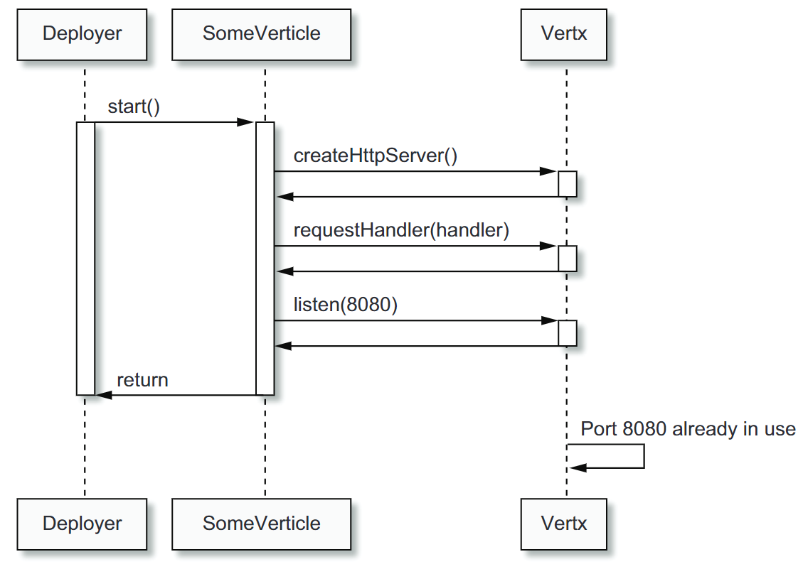

= Ch2_3

image:https://img.shields.io/badge/vert.x-4.4.0-purple.svg[link="https://vertx.io"]

== Asynchronous start life-cycle method

* Example where the verticle reports an asynchronous notification when it starts. This is important because starting a HTTP server can fail

* Vert.x Promise  is  an adaptation  of  the futures  and  promises  model  for  processing  asynchronous  results

* A promise is used to write an asynchronous result, whereas a future is used to view an asyn- chronous result.

* TIP It is a good robustness practice to use the asynchronous method variants that accept a callback to notify of errors

Sequence diagram of starting an HTTP server with a promise and a listen handler

Sequence diagram of starting an HTTP server without a promise and a listen handler

