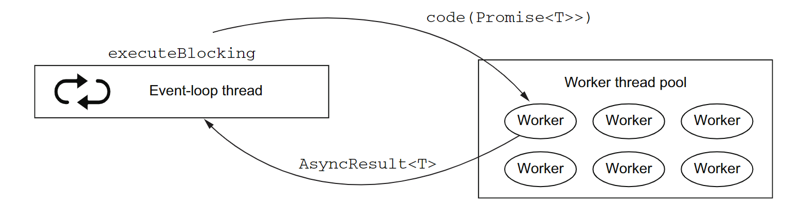

= Ch2_7

image:https://img.shields.io/badge/vert.x-4.4.0-purple.svg[link="https://vertx.io"]

There are inevitably cases where you will have a hard time avoiding blocking code. It  may  happen  because  you  are  using  a  third-party  library  with  another  threading model,  such  as  drivers  for  some  networked  services.  Vert.x  provides  two  options  for dealing with such cases: worker verticles and the executeBlocking operation

== The executeBlocking operation
The  other  option  for  running  blocking  code  is  to  use  the executeBlocking method from the Vertx class. This method takes some blocking code to execute, off- loads it to a worker thread, and sends the result back to the event loop as a new event

== TIP
By  default,  successive executeBlocking  operations  have  their  results processed in the same order as the calls to executeBlocking. There is a vari- ant of executeBlocking with an additional boolean parameter, and when it’s set to false, results are made available as event-loop events as soon as they are available, regardless of the order of the executeBlocking calls

