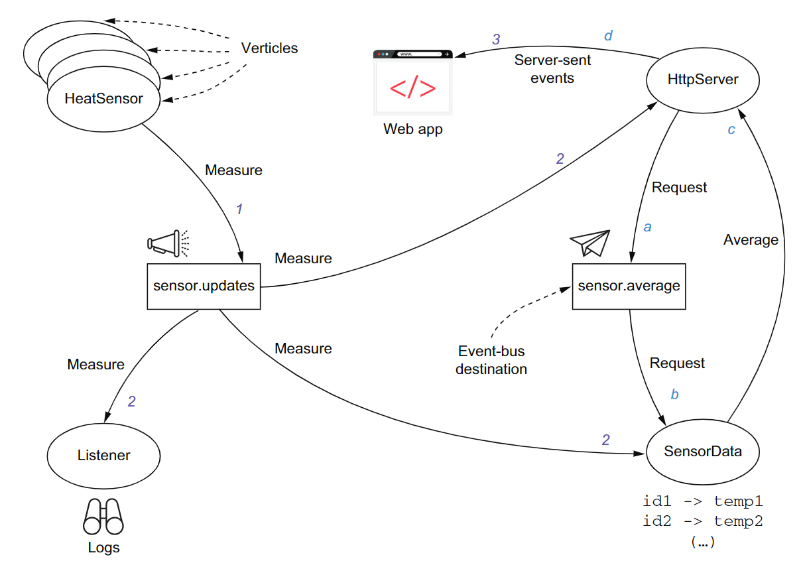

= Ch3_2

image:https://img.shields.io/badge/vert.x-4.4.0-purple.svg[link="https://vertx.io"]

== What is the event bus?
The event bus is a means for sending and receiving messages in an asynchronous fashion.
The event bus allows for decoupling between verticles. There is no need for one verticle to access another verticle class—all that is needed is to agree on destination names  and  data  representation.  

Communications over the event bus follow three patterns:

* Point-to-point messaging 
* Request-reply messaging 
* Publish/subscribe messaging

Event bus for verticle-to-verticle communications inside an application, not a message bus for application-to-application communications

Specifically, the event bus does not do the following:

* Support message acknowledgments 
* Support message priorities 
* Support message durability to recover from crashes 
* Provide routing rules 
* Provide transformation rules (schema adaptation, scatter/gather, etc.)

The event bus simply carries volatile events that are being processed asynchronously by verticles

== The event bus in an example 

