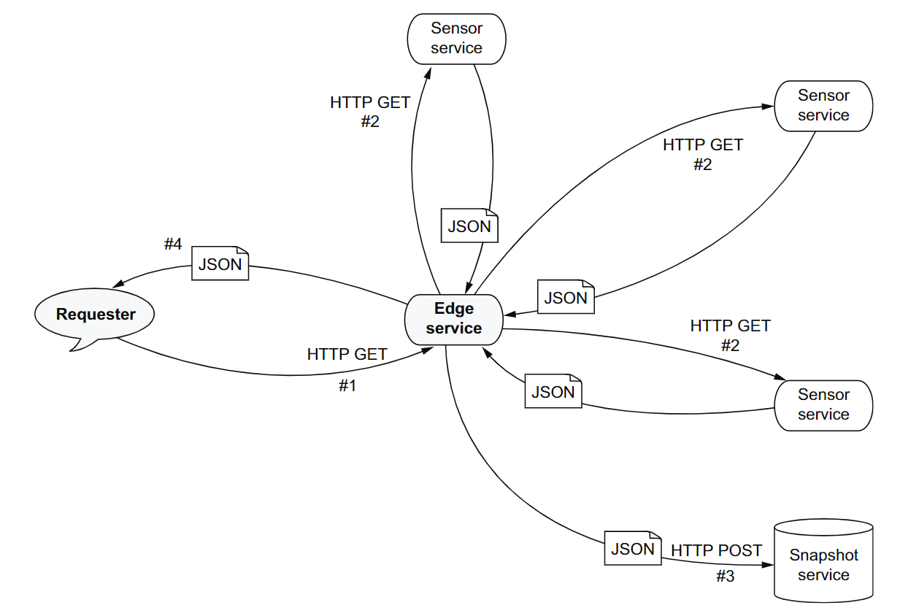

= Ch5_1

image:https://img.shields.io/badge/vert.x-4.4.0-purple.svg[link="https://vertx.io"]

== Composing asynchronous operations: The edge service example 

This example allows us to reason about parallel and sequential operations:

* Parallel asynchronous operations: fetching heat sensor data 
* Sequential  asynchronous  operations:  aggregating  heat  sensor  data,  sending  it to the snapshot service, and then returning it to the requester
